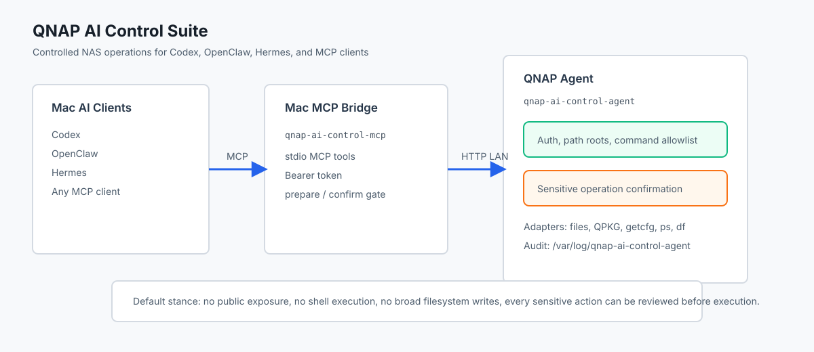
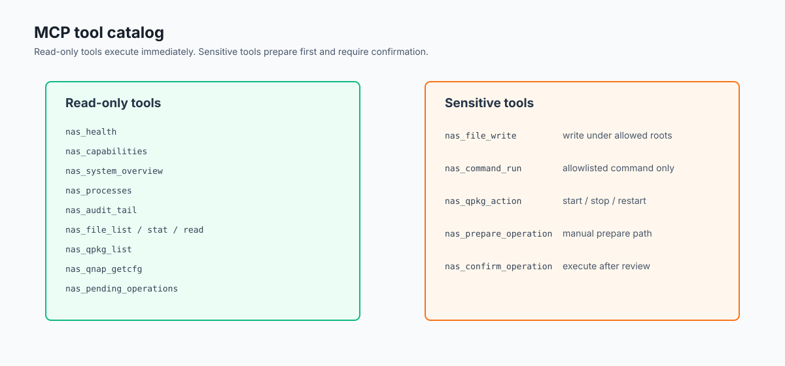
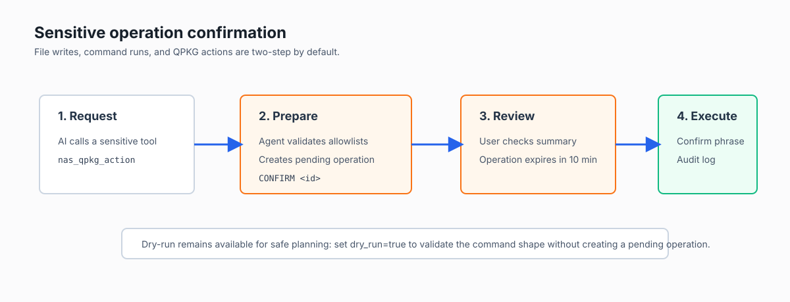

# QNAP AI Control Suite

让 Mac 上的 Codex、OpenClaw、Hermes 和其他 MCP 客户端以受控方式操作 QNAP NAS。



## 这是什么

QNAP AI Control Suite 是一个 NAS 端控制代理加 Mac 端 MCP 桥接器。

- NAS 端：`qnap-ai-control-agent` 作为 QPKG 服务运行，负责真实文件、套件、命令和审计能力。
- Mac 端：`qnap-ai-control-mcp` 作为 MCP stdio server，把 NAS 能力暴露给 Codex、OpenClaw、Hermes。
- 安全层：写文件、执行命令、启停套件等敏感操作默认走 prepare / confirm 两段式确认。

它比单纯的 QNAP MCP 更适合深度控制，因为 MCP server 不直接绑定 NAS 实现。NAS 权限、审计、命令白名单和扩展适配都在 NAS 端代理里管理，Mac 端只是协议桥。

## 功能

当前 `0.2.0` 版本包含：

- NAS 健康检查和能力清单
- 系统概览、磁盘、进程列表
- `/share` 目录下文件列表、stat、读取、写入
- QPKG 套件列表、start、stop、restart
- QNAP `getcfg` 配置读取，限制在 `/etc/config/*.conf`
- allowlist 命令执行，不经过 shell
- JSONL 审计日志
- 敏感操作 prepare / confirm 确认流
- Mac MCP 工具集，支持 Codex/OpenClaw/Hermes 接入



## 快速开始

构建 NAS agent：

```bash
cd /path/to/qnap-ai-control-suite
chmod +x scripts/*.sh qpkg/shared/qnap-ai-control-agent.sh mac-bridge/src/mcp-server.js
./scripts/build_agent.sh
```

正式 QPKG 使用 [qnap-dev/QDK](https://github.com/qnap-dev/QDK) 的 `qbuild`。把 QDK 克隆到 `tools/QDK` 后运行：

```bash
gh repo clone qnap-dev/QDK tools/QDK
make -C tools/QDK/src
./scripts/package_qpkg.sh amd64
```

输出：

```text
dist/QnapAIControl_0.2.0_x86_64.qpkg
dist/QnapAIControl_0.2.0_x86_64.qpkg.md5
```

没有 QDK 时，脚本会生成 staging archive，用来检查包结构，但不是正式可安装 `.qpkg`。

## MCP 配置

Mac 端 MCP server 命令：

```bash
node /path/to/qnap-ai-control-suite/mac-bridge/src/mcp-server.js
```

环境变量：

```bash
QACS_BASE_URL=http://NAS_IP:8756
QACS_TOKEN=从 NAS /etc/config/qnap-ai-control-agent/initial-token.txt 读取
```

## 敏感操作确认

非 dry-run 的 `nas_file_write`、`nas_command_run`、`nas_qpkg_action` 不会直接执行。它们会返回待确认操作：

```json
{
  "confirmation_required": true,
  "operation": {
    "id": "...",
    "summary": "restart QPKG MoviePilot",
    "confirmation_phrase": "CONFIRM ..."
  }
}
```

确认后再调用：

```json
{
  "tool": "nas_confirm_operation",
  "arguments": {
    "id": "...",
    "confirmation_phrase": "CONFIRM ..."
  }
}
```



## 文档

- [安装和部署](docs/install.md)
- [MCP 客户端配置](docs/mcp-clients.md)
- [敏感操作确认机制](docs/confirmations.md)
- [QPKG 构建说明](docs/qpkg-build.md)
- [架构说明](docs/architecture.md)

## 安全边界

默认配置只开放 `/share` 文件区和少量系统命令。不要把 `8756` 端口暴露到公网。远程控制建议使用 VPN、Tailscale、WireGuard 或 SSH tunnel。

如果要扩展到更高权限，建议按 profile 管理：

- `observe`: 只读状态、日志、配置
- `operate`: 服务重启、受控配置编辑
- `admin`: 存储、网络、容器、套件安装等高风险操作

## 项目结构

```text
agent/       QNAP 端 Go 控制代理
mac-bridge/  Mac 端 MCP stdio server
qpkg/        QPKG 元数据和服务脚本
scripts/     构建与打包脚本
docs/        使用教程、架构文档和图片
configs/     配置模板
```
