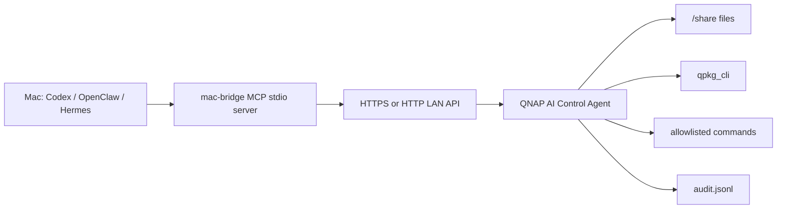

# Architecture

## Components



## Why this is broader than a simple QNAP MCP server

A plain MCP server usually exposes a small fixed tool set. This suite separates the NAS control plane from the Mac AI control plane:

- The NAS agent owns real NAS capabilities, permissions, audit, and local process access.
- The Mac bridge adapts those capabilities to MCP for Codex, OpenClaw, Hermes, or other clients.
- New NAS adapters can be added without changing every Mac client.
- High-risk operations can be handled as two-step plans instead of one-shot tool calls.

## Permission model

The first version has one restricted profile:

- `allowed_roots`: file paths that may be listed, read, or written.
- `allowed_commands`: exact executable paths that may be run.
- `allow_shell`: disabled by default. Keep it disabled unless the NAS is isolated and the command caller is trusted.

Future profiles should be explicit:

- `observe`: status, logs, read-only inventory.
- `operate`: service restart, safe config edit with dry-run diff.
- `admin`: storage/network/package/container actions that can break services.

## API surface

Current endpoints:

- `GET /v1/health`
- `GET /v1/capabilities`
- `GET /v1/system/overview`
- `GET /v1/system/processes`
- `GET /v1/audit/tail`
- `GET /v1/files/list?path=/share/...`
- `GET /v1/files/stat?path=/share/...`
- `POST /v1/files/read`
- `POST /v1/files/write`
- `POST /v1/command/run`
- `GET /v1/qnap/qpkg`
- `POST /v1/qnap/qpkg/action`
- `POST /v1/qnap/getcfg`
- `POST /v1/operations/prepare`
- `POST /v1/operations/confirm`
- `GET /v1/operations/pending`

All endpoints require:

```http
Authorization: Bearer <token>
```

## Threat model

Primary risks:

- A leaked token gives LAN access to allowed NAS operations.
- Over-broad `allowed_commands` can become equivalent to root.
- Exposing the service to the Internet creates a direct NAS control surface.
- Adding shell execution gives the model too much ambient authority.

Controls already present:

- SHA-256 token hash stored in config instead of plaintext token.
- No shell execution by default.
- Exact command allowlist.
- Path root checks for file access.
- JSONL audit log.
- In-memory prepare / confirm flow for sensitive MCP operations.

Controls to add before serious admin use:

- mTLS client certificates.
- Per-tool roles.
- User confirmation tokens for destructive operations.
- Rate limiting and IP allowlist.
- Signed command plans.
