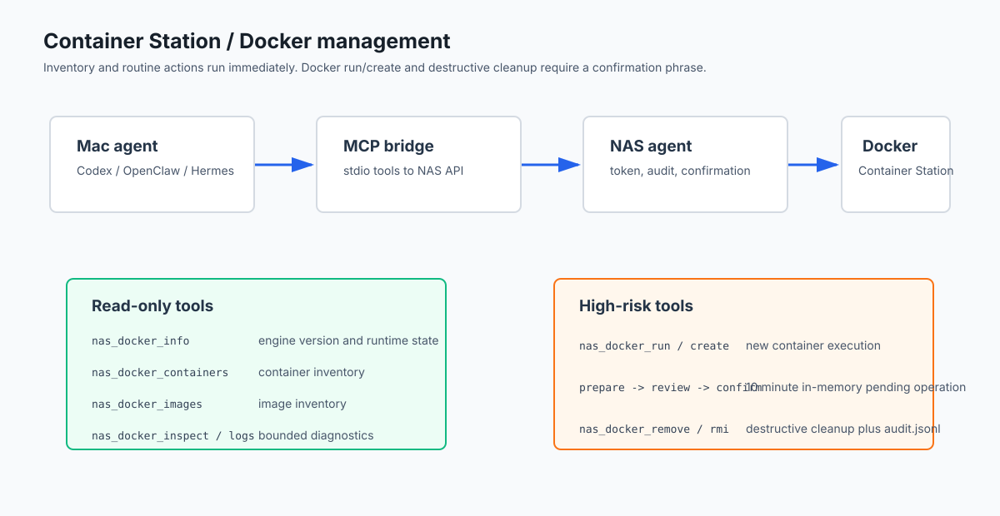

# Container Station / Docker 管理

`0.2.6` 开始，QNAP AI Control Suite 增加了 Container Station / Docker 管理能力。这个能力由 NAS 端 agent 调用本机 Docker CLI，Mac 端 MCP 只负责传递受控工具请求。



## 能做什么

只读能力会直接执行：

- `nas_docker_info`：读取 Docker engine 版本和运行状态。
- `nas_docker_containers`：列出所有容器，相当于受控的 `docker ps -a`。
- `nas_docker_images`：列出镜像。
- `nas_docker_inspect`：inspect 一个容器或镜像。
- `nas_docker_logs`：读取容器日志，默认 200 行，最多 2000 行。

敏感能力必须确认：

- `nas_docker_action`：`start`、`stop`、`restart`、`pause`、`unpause`。

## 安全边界

agent 没有开放任意 Docker 命令，也没有开放 shell。Docker 动作只允许固定子命令，并且容器名或 id 只允许字母、数字、`_`、`-`、`.`、`:`。

`nas_docker_action` 在 `dry_run: false` 时不会直接执行，会返回待确认操作。确认短语正确后，`nas_confirm_operation` 才执行真实动作。

## Docker CLI 路径

agent 默认查找这些路径：

```json
[
  "/share/CACHEDEV1_DATA/.qpkg/container-station/bin/docker",
  "/share/CACHEDEV1_DATA/.qpkg/container-station/usr/bin/docker",
  "/share/CACHEDEV5_DATA/.qpkg/container-station/bin/docker",
  "/share/CACHEDEV5_DATA/.qpkg/container-station/usr/bin/docker",
  "/usr/bin/docker",
  "/usr/local/bin/docker",
  "/bin/docker"
]
```

如果你的 NAS 路径不同，编辑：

```text
/etc/config/qnap-ai-control-agent/config.json
```

加入或修改：

```json
{
  "docker_paths": [
    "/你的/container-station/bin/docker",
    "/usr/bin/docker"
  ]
}
```

然后重启 QPKG。

## MCP 调用示例

查看 Docker 状态：

```json
{
  "tool": "nas_docker_info",
  "arguments": {}
}
```

列出容器：

```json
{
  "tool": "nas_docker_containers",
  "arguments": {}
}
```

查看某个容器日志：

```json
{
  "tool": "nas_docker_logs",
  "arguments": {
    "name": "moviepilot",
    "tail": 300
  }
}
```

先 dry-run 重启容器：

```json
{
  "tool": "nas_docker_action",
  "arguments": {
    "name": "moviepilot",
    "action": "restart",
    "dry_run": true,
    "reason": "确认 Docker restart 命令"
  }
}
```

准备真实重启：

```json
{
  "tool": "nas_docker_action",
  "arguments": {
    "name": "moviepilot",
    "action": "restart",
    "reason": "应用配置后重启容器"
  }
}
```

返回示例：

```json
{
  "confirmation_required": true,
  "operation": {
    "id": "abc...",
    "operation": "docker_action",
    "summary": "restart Docker container moviepilot",
    "confirmation_phrase": "CONFIRM abc..."
  }
}
```

执行确认：

```json
{
  "tool": "nas_confirm_operation",
  "arguments": {
    "id": "abc...",
    "confirmation_phrase": "CONFIRM abc..."
  }
}
```

## 故障排查

`docker CLI was not found`：

- Container Station 没安装或没启动。
- Docker CLI 不在默认路径里。
- 需要把实际 Docker 路径加入 `docker_paths`。

`permission denied`：

- QPKG 运行用户没有权限访问 Docker socket。
- Container Station 自身未启动完成。

容器名报错：

- 使用 `nas_docker_containers` 复制返回里的容器 `Names` 或 `ID`。
- 不要传 shell 片段、空格、通配符或管道符。
