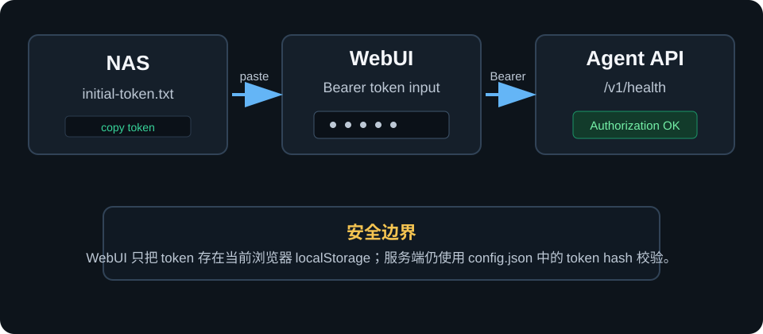

# WebUI 使用教程

QNAP AI Control 的 WebUI 地址：

```text
http://NAS_IP:8756/
```

例如：

```text
http://NAS_IP:8756/
```

## 1. 在 WebUI 设置 token

首次启动 QPKG 后，NAS 会生成 token 文件：

```text
/etc/config/qnap-ai-control-agent/initial-token.txt
```

把这个文件里的完整内容粘贴到 WebUI 左侧的 `Bearer token` 输入框，然后点击 `保存到浏览器`。

token 只保存在当前浏览器的 `localStorage`。它不会写入 HTML 页面，也不会公开显示。



## 2. 测试连接

点击 `测试连接`。

成功时，WebUI 会调用：

```text
GET /v1/health
Authorization: Bearer <token>
```

页面会显示 NAS 主机名和当前安全 profile。

## 3. 读取能力

点击 `读取能力`。

页面会调用：

```text
GET /v1/capabilities
Authorization: Bearer <token>
```

返回内容包含：

- 允许访问的根目录
- 允许执行的命令
- Container Station / Docker CLI 查找路径
- 是否允许 shell
- 敏感操作列表
- 确认操作超时时间

## 4. 生成 MCP 配置

打开 WebUI 的 `2. 配置 MCP` 标签页。

页面会根据当前访问地址自动生成：

```bash
QACS_BASE_URL=http://NAS_IP:8756
QACS_TOKEN=<token>
```

也会生成 Codex / OpenClaw / Hermes 通用 MCP JSON：

```json
{
  "mcpServers": {
    "qnap-ai-control": {
      "command": "node",
      "args": [
        "/path/to/qnap-ai-control-suite/mac-bridge/src/mcp-server.js"
      ],
      "env": {
        "QACS_BASE_URL": "http://NAS_IP:8756",
        "QACS_TOKEN": "<token>"
      }
    }
  }
}
```

把这段配置加入对应 agent 的 MCP server 列表后，重载 agent。重载后用 `nas_health` 测试连接，再用 `nas_docker_containers` 确认容器管理工具已经出现。

## 5. 敏感操作确认

WebUI 的 `3. 确认敏感操作` 标签页展示确认流程。

以下操作不会直接执行：

- 写文件
- 执行 allowlist 命令
- 启动、停止、重启 QPKG
- 启动、停止、重启、暂停、恢复 Docker 容器

流程是：

1. MCP 创建待确认操作。
2. 用户检查 summary 和 confirmation phrase。
3. 用户确认后，agent 才真正执行。
4. 结果写入审计日志。

审计日志路径：

```text
/var/log/qnap-ai-control-agent/audit.jsonl
```
